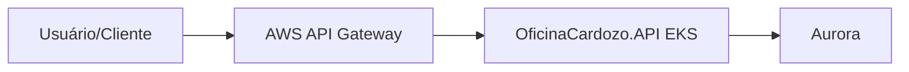

# OficinaCardozo.InfraK8s

## Descrição
Repositório com os manifests e configurações de infraestrutura para orquestração do cluster Kubernetes (EKS) da aplicação Oficina Cardozo.

## Tecnologias Utilizadas
- Kubernetes (EKS)
- AWS

## Passos para Execução e Deploy
1. Clone o repositório.
2. Configure o acesso ao cluster EKS.
3. Aplique os manifests com `kubectl apply -f <manifesto>.yaml`.

## Diagrama da Arquitetura

